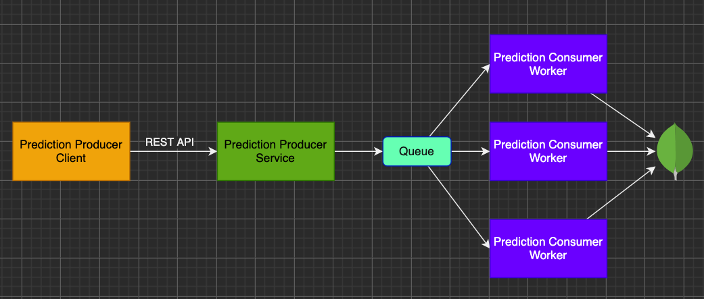

# AsyncCommunication

## Stack
1. [Nest.js](https://nestjs.com/) - node.js backend agnostic wrapper.
1. [MongoDB](https://www.mongodb.com/) - NoSQL db, mongoose for schemas.
1. [Redis](https://redis.io/) - cache key/value based db and more BE solutions.
1. [Bull](https://github.com/OptimalBits/bull) - Redis based queue manager.
1. [NX monorepo](https://nx.dev/) - managing monorepo and node dependencies.
1. [Solid](https://www.solidjs.com/) - ui framework
1. [Tailwindui](https://tailwindui.com/) - CSS builder
1. [Docker](https://www.docker.com/) - local container builder/runner

# Architecture

## Cloud
The diagram for cloud architecture can be found in diagrams folder.

Queue based on redis, alternatives GCP PubSub.

Cache based on nestjs ioredis used in the consumer, alternatives MemoryCache.

TBD: Alternative, DB solution for similar requests issue - index all 4 fields and use get by the data sent in the post.



## Project
The project is built on top on nx monorepo, which provides very cool project management tools.
One of these tools is the command ```npx nx dep-graph```, which will provide interactive browser tab with much more information over the provided image.

From the image we can see that we have 3 main projects: client, worker and api - represent our microservices. The applications/projects are reusing code from shared local libs.
The most interesting package is predictions lib, being shared by all the services. It includes:
1. Mongodb Schema for projections api.
2. Projections mongoose actions service. 
3. DTO related to projections api's.

Rest of the libs are related to nestjs boilerplate like logger, filtering, swagger and env module.


# Local env

Run Redis and MongoDB locally:

```
docker-compose up redis db
```

Run the services in divided windows - suggested for clearer logs:
```
npx nx run client:serve
npx nx run worker:serve
npx nx run api:serve
```
Or, all at once in single terminal
```
npx nx run-many --target=serve --parallel --all --maxParallel=3
```


# Docker env
Build the projects (webpack)
```
npx nx run-many --target=build --parallel --all --maxParallel=3
```

Build docker images:
```
npx nx run-many --target=docker --parallel --all --maxParallel=3
```
Or
```
docker-compose build --parallel --force-rm
```
Run the services: redis, mongo, api and worker - front-end is not included in docker-compose
```
docker-compose up
```
Run dev env for front end if needed - swagger as alternative.
```
npx nx run client:serve
```

## local ports 
Port allocations are the same in dev env and in docker.

client -  http://localhost:3000 - single page with form for post and table for get.

worker -  http://localhost:3334 - nothing to see, async process - service only

api -  http://localhost:3333/api - swagger ui

## extra urls
bull queue dashboard - http://localhost:3333/admin/queues
